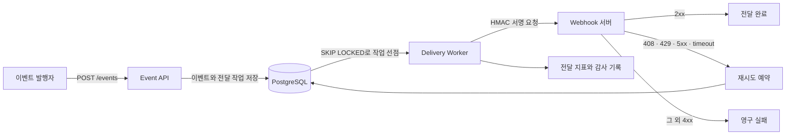

# HookRelay

Webhook 이벤트를 비동기로 전달하고 실패한 요청을 재시도하거나 격리하는 Kotlin/Spring Boot 프로젝트를 만들어봤습니다.

## 현재 상태

전달 정책을 먼저 고정한 뒤 이벤트 접수, 비동기 전달, 관측 환경까지 연결했습니다.

- HMAC-SHA256 서명과 검증
- HTTP 상태별 재시도 판단과 지수 backoff
- Webhook URL의 scheme·userinfo·사설 주소 검사
- 구독별 endpoint와 이벤트 유형 등록
- `Idempotency-Key` 기반 이벤트 중복 방지
- 이벤트와 전달 작업의 트랜잭션 저장
- Flyway 초기 schema
- `FOR UPDATE SKIP LOCKED`와 lease token 기반 작업 선점
- HMAC 서명 HTTP 전달과 시도 이력 저장
- `Retry-After`와 지수 backoff를 반영한 재시도
- 전달 작업 선점 수와 결과별 처리 시간 지표
- k6로 고정 요청률 이벤트 접수 측정
- Docker Compose 기반 로컬 전달 시연과 Grafana 대시보드

Worker 실행 경로와 실패 분류는 단위 테스트로 확인했습니다. Flyway schema, 트랜잭션 rollback, 작업 선점 SQL과 lease 재선점은 Testcontainers PostgreSQL에서 검증했습니다. 두 Worker를 함께 실행한 테스트에서는 첫 Worker가 전달 중인 작업을 두 번째 Worker가 다시 선점하지 않는 것도 확인했습니다. WireMock에서는 실제 HTTP 본문과 HMAC 헤더, `Retry-After`, redirect 차단을 확인했습니다. Micrometer 지표는 결과별 기록과 Prometheus scrape 응답까지 검증했습니다.

2026-09-12 로컬 Java 17과 Docker 29.7.2 환경에서 전체 테스트 43개가 통과했습니다. 실패 0개, 오류 0개, skipped 0개이며 PostgreSQL 17 Testcontainers 통합 테스트 8개와 WireMock HTTP 통합 테스트 3개가 포함됩니다. 인터넷 외부 주소로 요청을 보내지는 않았습니다.

## 동작 흐름



## 설계 기준

- 이벤트 접수는 빠르게 `202 Accepted`로 끝내고 전달은 Worker가 처리합니다.
- 같은 `Idempotency-Key`로 들어온 이벤트는 한 번만 저장합니다.
- Worker는 lease와 `FOR UPDATE SKIP LOCKED`를 사용해 전달 작업을 나눠 처리합니다.
- timeout, `408`, `429`, `5xx`는 재시도하고 나머지 `4xx`는 영구 실패로 분류합니다.
- 최대 시도 횟수를 넘긴 작업은 Dead Letter 상태로 옮깁니다. 수동 재전송 API는 다음 구현 범위입니다.
- Webhook 요청은 HMAC-SHA256으로 서명합니다.
- 사용자가 등록한 URL을 서버가 호출하므로 SSRF 방어를 별도 경계로 둡니다.

## 기술 구성

- Kotlin 2.2.21, Java 17
- Spring Boot 4.0.3, Gradle
- PostgreSQL, Flyway
- Spring MVC, JPA
- Java HttpClient
- Micrometer, Prometheus scrape endpoint
- Docker Compose, Prometheus, Grafana
- Testcontainers
- WireMock
- k6

Redis와 Kafka는 첫 구현에 넣지 않습니다. PostgreSQL만으로 작업 선점·재시도·복구 계약을 검증한 뒤 병목이 확인될 때 도입 여부를 판단합니다.

## 운영 지표

- `hookrelay.delivery.claimed`: Worker가 선점한 전달 작업 수
- `hookrelay.delivery.processing`: 결과별 처리 횟수와 소요 시간

처리 결과는 `succeeded`, `retry_scheduled`, `failed`, `dead_letter`, `lease_lost`, `processing_error`로 구분합니다. 전달 ID, 구독 ID, endpoint URL처럼 계속 늘어날 수 있는 값은 태그에서 제외했습니다.

지표는 `/actuator/metrics`에서 확인할 수 있고 Prometheus scrape 형식은 `/actuator/prometheus`에서 제공합니다. 로컬 Docker Compose 환경에서는 Prometheus가 5초마다 수집하며 Grafana의 `Hook Relay Overview` 대시보드에서 상태와 전달 결과를 확인할 수 있습니다.

## 로컬 시연

Docker Desktop을 실행한 뒤 PowerShell에서 아래 명령을 사용합니다.

```powershell
.\demo\run-demo.ps1
```

스크립트는 애플리케이션·PostgreSQL·Webhook 수신기·Prometheus·Grafana를 기동하고 구독 등록부터 실제 전달 성공까지 확인합니다. 완료 후 Grafana는 [http://127.0.0.1:3000/d/hook-relay-overview](http://127.0.0.1:3000/d/hook-relay-overview)에서 볼 수 있습니다.

```powershell
docker compose down
```

로컬 시연 환경에서만 HTTP와 사설 Webhook 대상을 명시적으로 허용합니다. 기본 애플리케이션 설정은 HTTPS와 공개 주소만 허용합니다. 세부 실행 방법과 데이터 초기화는 [Docker Compose 로컬 시연](docs/demo.md)에 정리했습니다.

## API 예시

구독을 등록하면 Webhook 요청 검증에 사용할 서명 비밀값이 응답에 포함됩니다.

```bash
curl -X POST http://localhost:8080/api/v1/subscriptions \
  -H "Content-Type: application/json" \
  -d '{
    "name": "order receiver",
    "endpointUrl": "https://hooks.example.com/events",
    "eventTypes": ["order.created", "order.cancelled"]
  }'
```

이벤트 접수 API는 JSON 본문과 멱등키를 받아 대상 구독 수만큼 전달 작업을 만듭니다.

```bash
curl -X POST http://localhost:8080/api/v1/events/order.created \
  -H "Content-Type: application/json" \
  -H "Idempotency-Key: order-20260911-1" \
  -d '{"orderId": 1001}'
```

같은 멱등키와 같은 요청을 다시 보내면 기존 이벤트 ID를 반환하고 `Idempotency-Replayed: true` 헤더를 붙입니다. 같은 키로 다른 이벤트 유형이나 본문을 보내면 `409 Conflict`로 처리합니다.

## 검증 현황

- [x] 같은 멱등키를 두 번 보내도 전달 작업이 중복 생성되지 않는가
- [x] Worker 두 개가 같은 작업을 동시에 처리하지 않는가
- [x] timeout과 재시도 가능한 HTTP 상태를 정책대로 분류하는가
- [ ] 실제 Worker 프로세스를 종료해도 lease 만료 후 작업을 복구하는가
- [x] payload가 바뀌면 HMAC 검증이 실패하는가
- [x] localhost와 사설 주소가 Webhook 대상으로 등록되지 않는가
- [x] 최대 시도 횟수를 넘긴 작업이 Dead Letter 상태로 이동하는가

2026-09-12 로컬 환경에서 이벤트 접수 경로에 초당 50건을 60초 동안 보냈습니다. 측정 요청 3,001건의 p50은 13.77ms, p95는 28.20ms, p99는 49.73ms였으며 오류와 dropped iteration은 없었습니다. 이벤트마다 전달 작업 1건을 저장했고 DB 건수도 요청 수와 일치했습니다. Worker HTTP 전달은 이번 측정에서 제외했습니다.

## 문서

- [PostgreSQL 작업 큐를 먼저 사용하는 이유](docs/adr/0001-postgresql-delivery-queue.md)
- [구현 순서와 완료 기준](docs/roadmap.md)
- [테스트 실행 기록](docs/test-execution-log.md)
- [이벤트 접수 부하 측정](docs/load-test.md)
- [Docker Compose 로컬 시연](docs/demo.md)

## 참고 기준

- [GitHub Webhook 권장사항](https://docs.github.com/en/webhooks/using-webhooks/best-practices-for-using-webhooks)
- [OWASP SSRF Prevention Cheat Sheet](https://cheatsheetseries.owasp.org/cheatsheets/Server_Side_Request_Forgery_Prevention_Cheat_Sheet.html)
- [Spring Boot Metrics](https://docs.spring.io/spring-boot/reference/actuator/metrics.html)
- [Micrometer metric naming](https://docs.micrometer.io/micrometer/reference/concepts/naming.html)
- [k6 constant arrival rate](https://grafana.com/docs/k6/latest/using-k6/scenarios/executors/constant-arrival-rate/)
- [Docker Compose 시작 순서](https://docs.docker.com/compose/how-tos/startup-order/)
- [Grafana provisioning](https://grafana.com/docs/grafana/latest/administration/provisioning/)
- [Spring Boot Testcontainers 지원](https://docs.spring.io/spring-boot/reference/features/dev-services.html)
