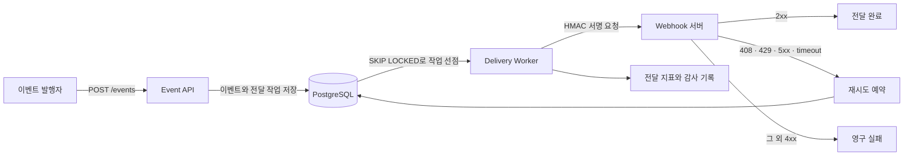

# HookRelay

Webhook 이벤트를 비동기로 전달하고 실패한 요청을 재시도하거나 격리하는 Kotlin/Spring Boot 프로젝트를 만들어봤습니다.

## 현재 상태

첫 단계에서는 전달 정책의 기준부터 코드로 고정하고 있습니다.

- HMAC-SHA256 서명과 검증
- HTTP 상태별 재시도 판단과 지수 backoff
- Webhook URL의 scheme·userinfo·사설 주소 검사
- PostgreSQL 작업 큐를 선택한 이유와 후속 검증 범위 문서화

구독·이벤트 API, PostgreSQL delivery queue와 실제 HTTP Worker는 다음 단계에서 연결합니다. 아직 처리량이나 운영 안정성을 확인한 단계는 아닙니다.

2026-09-11 로컬 Java 17 환경에서 전달 정책 단위 테스트 13개가 통과했습니다. 실패 0개, 오류 0개, skipped 0개이며 Docker와 외부 HTTP 요청은 이번 검증에 포함하지 않았습니다.

## 동작 흐름

## 설계 기준

- 이벤트 접수는 빠르게 `202 Accepted`로 끝내고 전달은 Worker가 처리합니다.
- 같은 `Idempotency-Key`로 들어온 이벤트는 한 번만 저장합니다.
- Worker는 lease와 `FOR UPDATE SKIP LOCKED`를 사용해 전달 작업을 나눠 처리합니다.
- timeout, `408`, `429`, `5xx`는 재시도하고 나머지 `4xx`는 영구 실패로 분류합니다.
- 최대 시도 횟수를 넘긴 작업은 Dead Letter 상태로 옮기고 수동 재전송 경로를 제공합니다.
- Webhook 요청은 HMAC-SHA256으로 서명합니다.
- 사용자가 등록한 URL을 서버가 호출하므로 SSRF 방어를 별도 경계로 둡니다.

## 기술 구성

- Kotlin 2.2.21, Java 17
- Spring Boot 4.0.3, Gradle
- PostgreSQL, Flyway
- Spring MVC, JPA
- Testcontainers, WireMock
- Micrometer, Prometheus, Grafana

Redis와 Kafka는 첫 구현에 넣지 않습니다. PostgreSQL만으로 작업 선점·재시도·복구 계약을 검증한 뒤 병목이 확인될 때 도입 여부를 판단합니다.

## 검증할 시나리오

- 같은 멱등키를 두 번 보내도 전달 작업이 중복 생성되지 않는가
- Worker 두 개가 같은 작업을 동시에 처리하지 않는가
- timeout과 재시도 가능한 HTTP 상태를 정책대로 분류하는가
- Worker가 처리 중 종료되어도 lease 만료 후 작업을 복구하는가
- payload가 바뀌면 HMAC 검증이 실패하는가
- localhost와 사설 주소가 Webhook 대상으로 등록되지 않는가
- 최대 시도 횟수를 넘긴 작업이 Dead Letter 상태로 이동하는가

실제 테스트 수와 성능 수치는 검증을 마친 뒤 실행 조건과 함께 기록합니다.

## 문서

- [PostgreSQL 작업 큐를 먼저 사용하는 이유](docs/adr/0001-postgresql-delivery-queue.md)
- [구현 순서와 완료 기준](docs/roadmap.md)
- [테스트 실행 기록](docs/test-execution-log.md)

## 참고 기준

- [GitHub Webhook 권장사항](https://docs.github.com/en/webhooks/using-webhooks/best-practices-for-using-webhooks)
- [OWASP SSRF Prevention Cheat Sheet](https://cheatsheetseries.owasp.org/cheatsheets/Server_Side_Request_Forgery_Prevention_Cheat_Sheet.html)
- [Spring Boot Testcontainers 지원](https://docs.spring.io/spring-boot/reference/features/dev-services.html)
