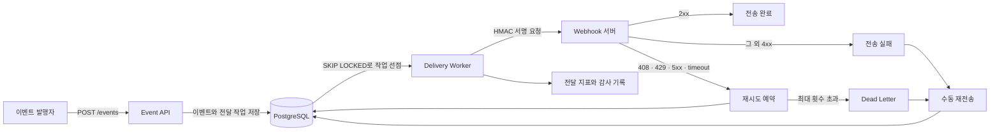

# HookRelay

[](https://github.com/sugowslt/Kotlin_Webhook_Platform/actions/workflows/ci.yml)

Webhook 이벤트를 비동기로 전달하고 실패한 요청을 재시도하거나 격리하는 Kotlin/Spring Boot 프로젝트를 만들어봤습니다.

## 현재 상태

전달 정책을 먼저 고정한 뒤 이벤트 접수, 비동기 전달, 관측 환경까지 연결했습니다.

- HMAC-SHA256 서명과 검증
- HTTP 상태별 재시도 판단과 지수 backoff
- Webhook URL의 scheme·userinfo·사설 주소 검사
- 구독별 endpoint와 이벤트 유형 등록
- `Idempotency-Key` 기반 이벤트 중복 방지
- 이벤트와 전달 작업의 트랜잭션 저장
- Flyway 초기 schema
- `FOR UPDATE SKIP LOCKED`와 lease token 기반 작업 선점
- Worker 강제 종료 후 lease 만료 작업 재선점
- HMAC 서명 HTTP 전달과 시도 이력 저장
- `Retry-After`와 지수 backoff를 반영한 재시도
- `FAILED`·`DEAD_LETTER` 전달의 수동 재전송 API
- 상태 필터와 cursor를 사용한 전달 목록·시도 이력 조회 API
- Bearer 토큰과 `OPERATOR` 권한을 사용한 전달 운영 API 보호
- 선점 가능·예약·처리·정체 작업 수와 선점 SQL 실행 시간 지표
- 고정 지연 수신기를 사용한 작업 대기열 적체 관측
- 전달 작업 선점 수와 결과별 처리 시간 지표
- Prometheus 경보 규칙과 `promtool` 단위 테스트
- k6로 고정 요청률 이벤트 접수 측정
- k6 고정 건수와 로컬 수신기를 사용한 Worker HTTP 전달 처리량 측정
- Worker 실행 분리와 1개·2개·4개 확장 처리량 비교
- Docker Compose 기반 로컬 전달 시연과 Grafana 대시보드

Worker 실행 경로와 실패 분류는 단위 테스트로 확인했습니다. Flyway schema, 트랜잭션 rollback, 작업 선점 SQL과 lease 재선점은 Testcontainers PostgreSQL에서 검증했습니다. 두 Worker를 함께 실행한 테스트에서는 첫 Worker가 전달 중인 작업을 두 번째 Worker가 다시 선점하지 않는 것도 확인했습니다. Compose에서는 HTTP 응답 대기 중 Worker를 `SIGKILL`로 종료하고, 재기동한 Worker가 lease 만료 후 같은 전달 ID를 복구하는 과정을 확인했습니다. WireMock에서는 실제 HTTP 본문과 HMAC 헤더, `Retry-After`, redirect 차단을 확인했습니다. Micrometer 지표는 결과별 기록과 Prometheus scrape 응답까지 검증했습니다.

2026-09-15 로컬 Java 17과 Docker 29.7.2 환경에서 전체 테스트 64개가 통과했습니다. 실패 0개, 오류 0개, skipped 0개이며 PostgreSQL 17 Testcontainers 통합 테스트 21개와 WireMock HTTP 통합 테스트 3개가 포함됩니다. 인터넷 외부 주소로 요청을 보내지는 않았습니다.

## 동작 흐름



## 설계 기준

- 이벤트 접수는 빠르게 `202 Accepted`로 끝내고 전달은 Worker가 처리합니다.
- 같은 `Idempotency-Key`로 들어온 이벤트는 한 번만 저장합니다.
- Worker는 lease와 `FOR UPDATE SKIP LOCKED`를 사용해 전달 작업을 나눠 처리합니다.
- timeout, `408`, `429`, `5xx`는 재시도하고 나머지 `4xx`는 영구 실패로 분류합니다.
- 최대 시도 횟수를 넘긴 작업은 Dead Letter 상태로 옮깁니다.
- `FAILED`와 `DEAD_LETTER`만 수동 재전송할 수 있습니다. 기존 전달 ID·시도 횟수·이력은 유지하고 대기열에 다시 넣습니다.
- 전달 목록·상세 조회와 수동 재전송은 32자 이상의 운영자 Bearer 토큰이 있어야 요청할 수 있습니다.
- 조회 응답에는 payload, endpoint URL, 서명 비밀값을 포함하지 않습니다.
- 전달 보장은 at-least-once입니다. 외부 서버가 요청을 처리한 직후 Worker가 종료되면 같은 전달 ID가 다시 전송될 수 있습니다.
- Webhook 요청은 HMAC-SHA256으로 서명합니다.
- 사용자가 등록한 URL을 서버가 호출하므로 SSRF 방어를 별도 경계로 둡니다.

## 기술 구성

- Kotlin 2.2.21, Java 17
- Spring Boot 4.0.3, Gradle
- PostgreSQL, Flyway
- Spring MVC, Spring Security, JPA
- Java HttpClient
- Micrometer, Prometheus scrape endpoint
- Docker Compose, Prometheus, Grafana
- Testcontainers
- WireMock
- k6

Redis와 Kafka는 첫 구현에 넣지 않습니다. PostgreSQL만으로 작업 선점·재시도·복구 계약을 검증한 뒤 병목이 확인될 때 도입 여부를 판단합니다.

## 운영 지표

- `hookrelay.delivery.claimed`: Worker가 선점한 전달 작업 수
- `hookrelay.delivery.claim`: 선점 SQL 실행 횟수와 소요 시간
- `hookrelay.delivery.queue.depth`: 현재 작업 대기열 수
- `hookrelay.delivery.processing`: 결과별 처리 횟수와 소요 시간

작업 대기열은 `claimable`, `scheduled`, `leased`, `stalled` 네 상태로 나눕니다. `claimable`에는 바로 선점할 수 있는 작업과 lease가 만료된 작업이 포함됩니다. `stalled`는 `PROCESSING` 상태인데 lease가 없는 비정상 작업입니다. 5초마다 PostgreSQL을 한 번 조회해 Gauge를 갱신하므로 Prometheus scrape 요청이 DB 쿼리를 직접 실행하지 않습니다.

Worker가 전달 요청을 처리하는 동안 Gauge 갱신이 밀리지 않도록 Spring 스케줄러 pool은 2개 스레드를 사용합니다. Prometheus에는 전체 애플리케이션 대상 중단, lease 없는 처리 작업, 선점 쿼리 실패를 감지하는 경보 규칙을 등록했습니다. 로컬 Compose에는 Alertmanager를 연결하지 않아 경보 상태만 확인할 수 있고 외부 알림은 전송하지 않습니다.

여러 애플리케이션 인스턴스가 같은 DB를 보면 각 인스턴스가 전역 작업 수를 동일하게 노출할 수 있습니다. Grafana의 작업 대기열 그래프는 인스턴스별 값을 더하지 않고 상태별 최댓값을 사용합니다. 처리 결과는 `succeeded`, `retry_scheduled`, `failed`, `dead_letter`, `lease_lost`, `processing_error`로 구분하며 전달 ID, 구독 ID, endpoint URL처럼 계속 늘어날 수 있는 값은 태그에서 제외했습니다.

지표는 `/actuator/metrics`에서 확인할 수 있고 Prometheus scrape 형식은 `/actuator/prometheus`에서 제공합니다. 로컬 Docker Compose 환경에서는 Prometheus가 5초마다 수집하며 Grafana의 `Hook Relay Overview` 대시보드에서 작업 대기열, 선점 시간, 전달 결과를 확인할 수 있습니다.

## 로컬 시연

Docker Desktop을 실행한 뒤 PowerShell에서 아래 명령을 사용합니다.

```powershell
.\demo\run-demo.ps1
```

스크립트는 애플리케이션·PostgreSQL·Webhook 수신기·Prometheus·Grafana를 기동하고 구독 등록부터 실제 전달 성공까지 확인합니다. 완료 후 Grafana는 [http://127.0.0.1:3000/d/hook-relay-overview](http://127.0.0.1:3000/d/hook-relay-overview)에서 볼 수 있습니다.

실패한 전달의 수동 재전송은 별도 스크립트로 확인합니다. 첫 요청을 `400`으로 실패시킨 뒤 재전송 API를 호출하고, 두 번째 요청이 `204`로 끝나는지와 시도 이력 `FAILED,SUCCEEDED`를 검사합니다.

```powershell
.\demo\run-redelivery-demo.ps1
```

스크립트의 기본 운영자 토큰은 Compose 전용 공개 시연값입니다. 다른 값을 시험하려면 Compose의 `HOOK_RELAY_OPERATOR_TOKEN`과 스크립트의 `-OperatorToken` 인자를 같은 32자 이상 값으로 바꿉니다.

Worker 강제 종료 후 복구는 아래 스크립트로 확인합니다. 첫 요청을 수신기가 보류한 상태에서 애플리케이션만 `SIGKILL`로 종료하고, 재기동한 Worker가 lease 만료 후 같은 전달 ID를 다시 보내는지 검사합니다.

```powershell
.\demo\run-crash-recovery-demo.ps1
```

작업 대기열 변화는 수신 응답을 250ms 늦추고 고유 이벤트 100건을 접수하는 스크립트로 확인합니다. PostgreSQL 상태와 Prometheus Gauge를 함께 표본화하고 이벤트·전달·시도 이력 건수가 모두 일치하는지 검사합니다.

```powershell
.\demo\run-backlog-observability-demo.ps1
```

Worker HTTP 전달 처리량은 Worker 실행 주기를 1시간으로 늘린 상태에서 고유 이벤트 500건을 적재한 뒤 기본 batch와 실행 주기로 다시 시작해 3회 측정합니다. 매회 이벤트·전달·시도 이력·수신 요청이 모두 500건인지 확인합니다.

```powershell
.\demo\run-worker-throughput-demo.ps1
```

Worker 수에 따른 확장은 대기열 500건·1,000건과 Worker 1개·2개·4개 조합을 각각 3회 측정합니다. API 애플리케이션의 Worker를 끄고 Compose profile의 Worker만 확장해 모든 인스턴스가 같은 PostgreSQL 작업 큐를 처리하도록 고정합니다.

```powershell
.\demo\run-worker-scaling-demo.ps1
```

```powershell
docker compose down
```

로컬 시연 환경에서만 HTTP와 사설 Webhook 대상을 명시적으로 허용합니다. 기본 애플리케이션 설정은 HTTPS와 공개 주소만 허용합니다. 세부 실행 방법과 데이터 초기화는 [Docker Compose 로컬 시연](docs/demo.md)에 정리했습니다.

## API 예시

구독을 등록하면 Webhook 요청 검증에 사용할 서명 비밀값이 응답에 포함됩니다.

```bash
curl -X POST http://localhost:8080/api/v1/subscriptions \
  -H "Content-Type: application/json" \
  -d '{
    "name": "order receiver",
    "endpointUrl": "https://hooks.example.com/events",
    "eventTypes": ["order.created", "order.cancelled"]
  }'
```

이벤트 접수 API는 JSON 본문과 멱등키를 받아 대상 구독 수만큼 전달 작업을 만듭니다.

```bash
curl -X POST http://localhost:8080/api/v1/events/order.created \
  -H "Content-Type: application/json" \
  -H "Idempotency-Key: order-20260911-1" \
  -d '{"orderId": 1001}'
```

같은 멱등키와 같은 요청을 다시 보내면 기존 이벤트 ID를 반환하고 `Idempotency-Replayed: true` 헤더를 붙입니다. 같은 키로 다른 이벤트 유형이나 본문을 보내면 `409 Conflict`로 처리합니다.

운영자는 상태별 전달 목록에서 전달 ID를 찾고 상세 응답에서 시도 이력을 확인할 수 있습니다. 목록은 기본 30건, 최대 100건이며 응답의 `nextCursor`로 다음 페이지를 조회합니다.

```bash
curl "http://localhost:8080/api/v1/deliveries?status=DEAD_LETTER&limit=30" \
  -H "Authorization: Bearer $HOOK_RELAY_OPERATOR_TOKEN"

curl http://localhost:8080/api/v1/deliveries/{deliveryId} \
  -H "Authorization: Bearer $HOOK_RELAY_OPERATOR_TOKEN"
```

실패가 확정된 전달은 전달 ID로 다시 요청할 수 있습니다. 접수된 작업은 `202 Accepted`와 `PENDING` 상태를 반환하고 Worker가 비동기로 처리합니다. 이미 대기·처리 중이거나 성공한 전달은 `409 Conflict`, 없는 전달은 `404 Not Found`로 응답합니다.

```bash
curl -X POST http://localhost:8080/api/v1/deliveries/{deliveryId}/redeliveries \
  -H "Authorization: Bearer $HOOK_RELAY_OPERATOR_TOKEN"
```

토큰 누락, 잘못된 형식, 불일치는 모두 `401 Unauthorized`로 응답합니다. 기본 설정에는 토큰값이 없으며 `HOOK_RELAY_OPERATOR_TOKEN`이 32자보다 짧으면 애플리케이션이 시작되지 않습니다. Compose에 적힌 `local-demo-operator-token-not-secret`은 loopback 시연 전용이므로 다른 환경에서 사용하지 않습니다.

## 검증 현황

- [x] 같은 멱등키를 두 번 보내도 전달 작업이 중복 생성되지 않는가
- [x] Worker 두 개가 같은 작업을 동시에 처리하지 않는가
- [x] timeout과 재시도 가능한 HTTP 상태를 정책대로 분류하는가
- [x] 실제 Worker 프로세스를 종료해도 lease 만료 후 작업을 복구하는가
- [x] payload가 바뀌면 HMAC 검증이 실패하는가
- [x] localhost와 사설 주소가 Webhook 대상으로 등록되지 않는가
- [x] 최대 시도 횟수를 넘긴 작업이 Dead Letter 상태로 이동하는가
- [x] 실패한 전달만 수동 재전송되고 동시 요청은 한 건만 접수되는가
- [x] 운영자 토큰이 없거나 일치하지 않으면 수동 재전송이 거부되는가
- [x] 운영자만 전달 목록과 시도 이력을 중복 없이 페이지 조회할 수 있는가
- [x] 전달 조회 응답에서 payload와 endpoint·서명 비밀값을 제외했는가
- [x] 작업 대기열 상태와 선점 SQL 실행 시간이 Prometheus에 노출되는가
- [x] Worker 처리 중에도 작업 대기열 Gauge가 독립적으로 갱신되는가
- [x] Prometheus 경보가 정상·대상 중단·정체·선점 실패 조건을 구분하는가
- [x] 기본 Worker 설정에서 실제 HTTP 전달 처리량을 반복 측정했는가
- [x] 대기열 크기와 Worker 수를 바꿔 처리량과 선점 시간을 비교했는가

2026-09-12 로컬 환경에서 이벤트 접수 경로에 초당 50건을 60초 동안 보냈습니다. 측정 요청 3,001건의 p50은 13.77ms, p95는 28.20ms, p99는 49.73ms였으며 오류와 dropped iteration은 없었습니다. 이벤트마다 전달 작업 1건을 저장했고 DB 건수도 요청 수와 일치했습니다. Worker HTTP 전달은 이번 측정에서 제외했습니다.

2026-09-13에는 응답을 250ms 늦춘 로컬 수신기로 전달 작업 100건을 처리했습니다. 1.86초 동안 접수한 작업이 34.08초 안에 모두 끝났고 PostgreSQL과 Prometheus에서 `claimable` 최대 80건을 함께 확인했습니다. 이 값은 단일 Worker와 로컬 고정 지연 조건의 관측 결과이며 운영 처리량이나 경보 임계값으로 사용하지 않습니다.

2026-09-15에는 응답 지연이 없는 로컬 수신기로 전달 작업 500건을 3회 처리했습니다. 첫 시도 시작부터 마지막 시도 완료까지 평균 28.026초였고 처리량은 평균 17.84건/초, 범위는 17.79~17.88건/초였습니다. 매회 이벤트·전달·시도 이력·수신 요청이 각각 500건으로 일치했고 실패는 없었습니다. 단일 Worker와 기본 batch 20건·fixed delay 1초 조건의 로컬 기준값이며 최대 처리량이나 운영 용량을 뜻하지 않습니다.

같은 날 대기열 500건과 1,000건에서 Worker 1개·2개·4개를 각각 3회 비교했습니다. Worker 4개의 평균 처리량은 500건에서 60.95건/초, 1,000건에서 65.12건/초로 Worker 1개 대비 각각 3.46배와 3.73배였습니다. 현재 범위에서는 선점 실패나 중복 처리가 없었지만, 로컬 성공 응답 조건의 결과이므로 PostgreSQL의 운영 한계를 뜻하지 않습니다.

## 문서

- [PostgreSQL 작업 큐를 먼저 사용하는 이유](docs/adr/0001-postgresql-delivery-queue.md)
- [Webhook 전달을 at-least-once로 복구하는 이유](docs/adr/0002-at-least-once-delivery.md)
- [전달 운영 API를 Bearer 토큰으로 보호하는 이유](docs/adr/0003-operator-bearer-token.md)
- [전달 조회와 재전송](docs/delivery-operations.md)
- [구현 순서와 완료 기준](docs/roadmap.md)
- [테스트 실행 기록](docs/test-execution-log.md)
- [이벤트 접수 부하 측정](docs/load-test.md)
- [Worker HTTP 전달 처리량 측정](docs/worker-throughput.md)
- [다중 Worker 확장 측정](docs/worker-scaling.md)
- [작업 대기열 적체 관측](docs/backlog-observability.md)
- [Docker Compose 로컬 시연](docs/demo.md)

## 참고 기준

- [GitHub Webhook 권장사항](https://docs.github.com/en/webhooks/using-webhooks/best-practices-for-using-webhooks)
- [GitHub REST Webhook delivery API](https://docs.github.com/en/rest/repos/webhooks)
- [OWASP SSRF Prevention Cheat Sheet](https://cheatsheetseries.owasp.org/cheatsheets/Server_Side_Request_Forgery_Prevention_Cheat_Sheet.html)
- [PostgreSQL `SKIP LOCKED`](https://www.postgresql.org/docs/17/sql-select.html)
